# System Architecture Diagram

## Core System Components and Relationships

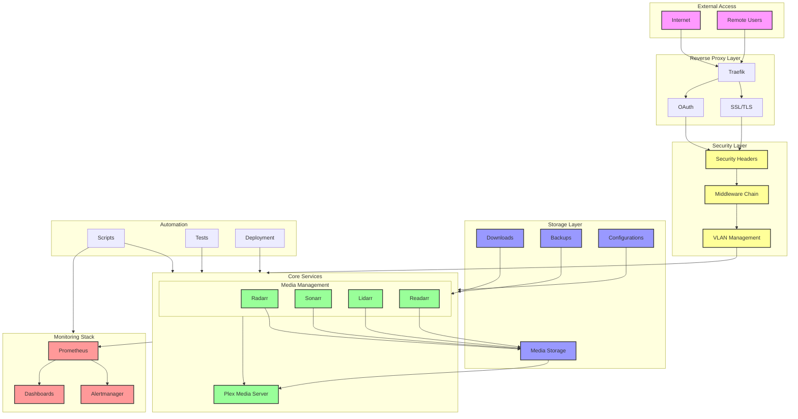

## Data Flow Diagram

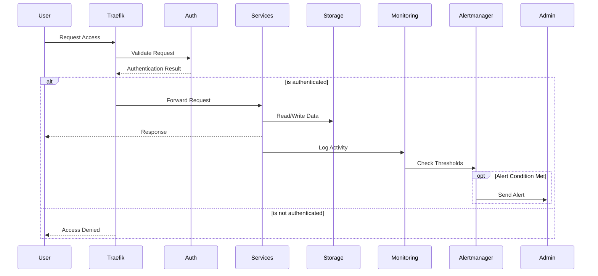

## Configuration Inheritance Diagram

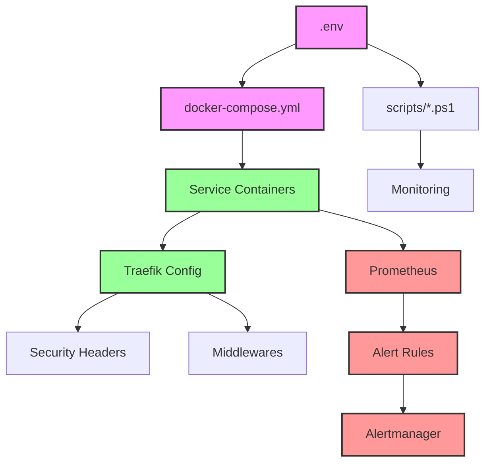

## Network Topology Diagram

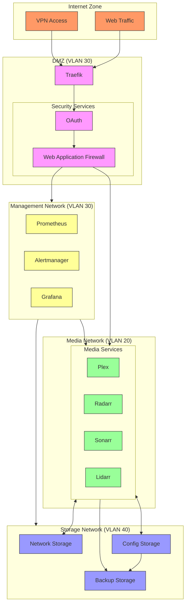

## Network Port Mapping

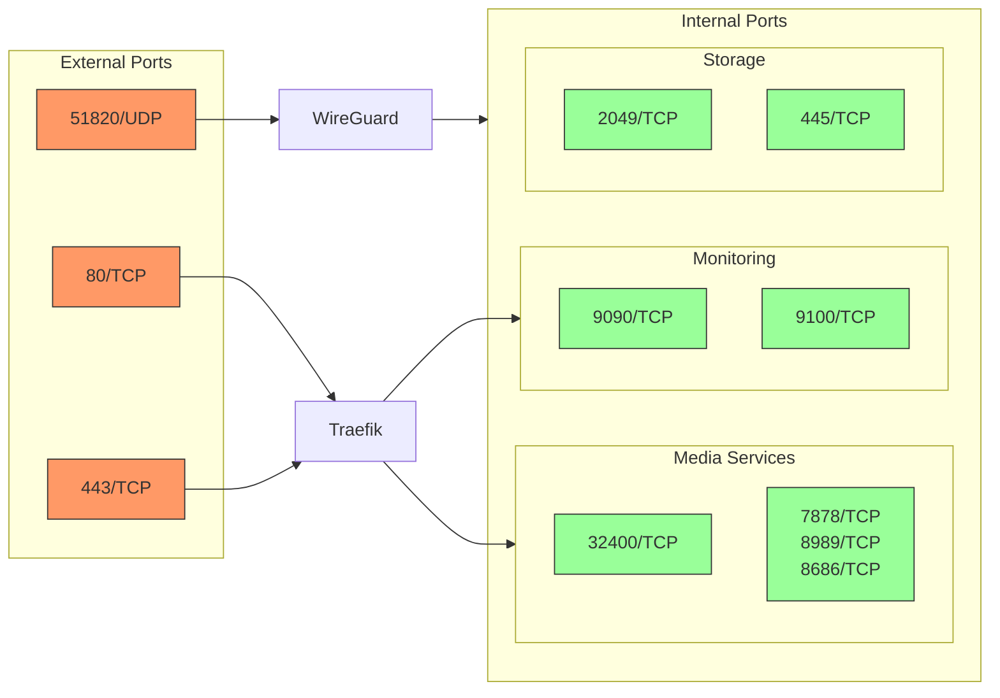

## Detailed Network Flows

### Media Access Flow

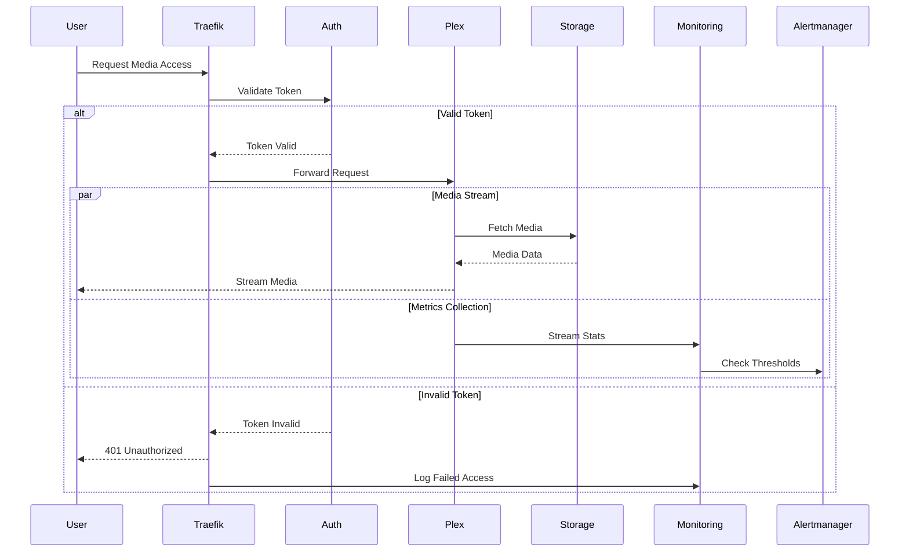

### Media Management Flow

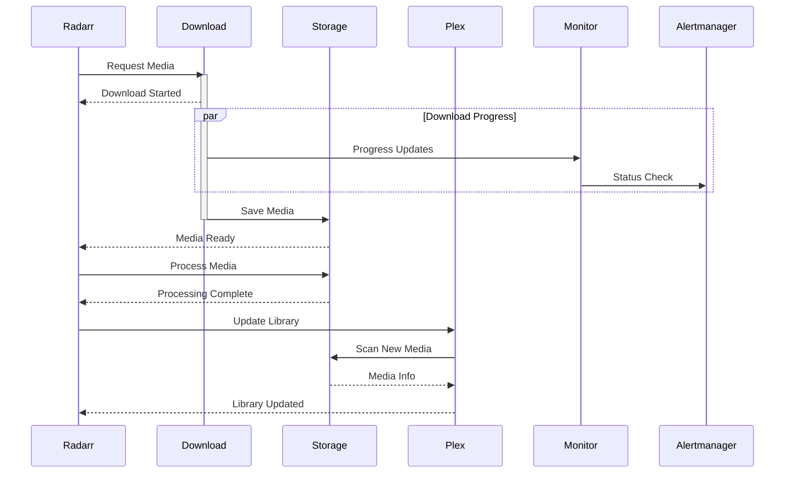

### Backup Flow

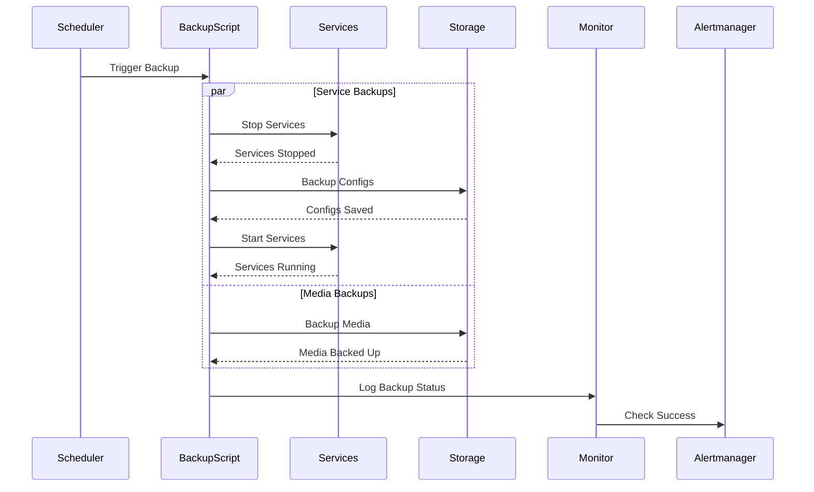

## Network Failure Scenarios

### Service Failover

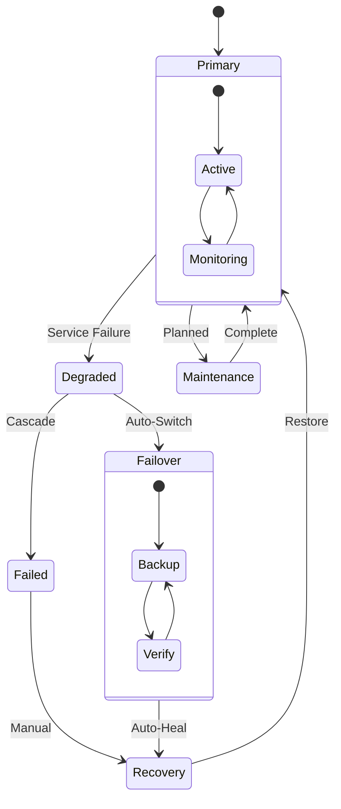

### Network Recovery Flow

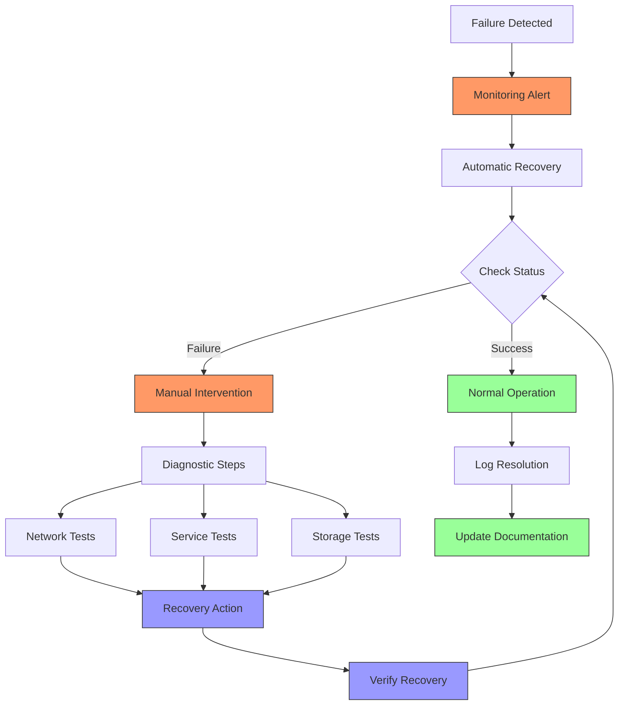

### VLAN Failure Recovery

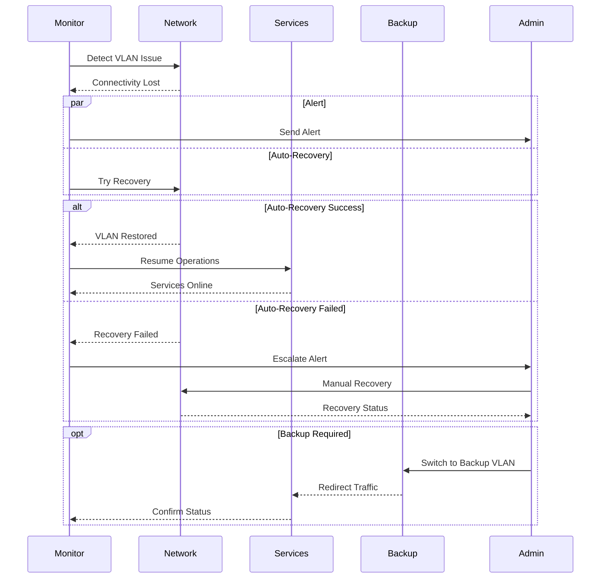