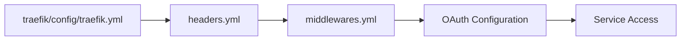
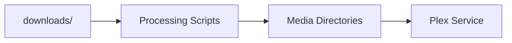

# Codebase Relationships Documentation

This document provides a comprehensive overview of how different components and files in the codebase interact with each other.

## Directory Structure Overview

```
.
├── alertmanager/          # Alert management configuration and rules
├── analysis/              # Analysis scripts and reports
├── backups/              # Backup storage location
├── books/                # Book media storage
├── certs/                # SSL certificates and related files
├── config/               # Global configuration files
├── docker/               # Docker-specific configurations
├── docs/                 # Project documentation
├── downloads/            # Temporary download location
├── letsencrypt/          # Let's Encrypt certificates
├── logs/                 # Application and system logs
├── media/                # General media storage
├── monitoring/           # Monitoring configurations and dashboards
├── movies/               # Movie media storage
├── music/                # Music media storage
├── prometheus/           # Prometheus configuration and rules
├── reports/              # Generated reports
├── scripts/              # Automation and maintenance scripts
├── secrets/              # Sensitive configuration files
├── traefik/              # Traefik reverse proxy configuration
└── tv/                   # TV shows media storage
```

## Key File Relationships

### 1. Configuration Files
- **Primary Configuration**
  - `.env`: Central environment configuration
    - Referenced by: `docker-compose.yml`, `scripts/*.ps1`, `deploy.ps1`
  - `docker-compose.yml`: Service definitions and networking
    - Dependencies: `.env`, `traefik/config/`
    - Referenced by: `deploy.ps1`, `test-setup.ps1`

- **Traefik Configuration**
  - `traefik/config/traefik.yml`: Main Traefik configuration
  - `traefik/config/dynamic/`:
    - `headers.yml`: Security headers configuration
    - `middlewares.yml`: Request middleware chains
    - `conf.yml`: Dynamic service configuration

### 2. Monitoring Stack
- **Prometheus Configuration**
  ```
  prometheus/
  ├── prometheus.yml           # Main configuration
  ├── rules/
  │   ├── network-alerts.yml   # Network-specific alerts
  │   └── service-alerts.yml   # Service health alerts
  ```
  Dependencies:
  - Referenced by: `monitoring/dashboards/`
  - Integrates with: `alertmanager/config.yml`

- **Alert Management**
  ```
  alertmanager/
  ├── config.yml              # Alert routing and notifications
  └── templates/              # Alert message templates
  ```
  Dependencies:
  - `email-config.yml`
  - Integrates with: `scripts/monitoring/`

### 3. Script Relationships
- **Monitoring Scripts**
  ```
  scripts/monitoring/
  ├── check-network-config.ps1    # Network health checks
  ├── schedule-network-checks.ps1 # Scheduled monitoring
  └── schedule-compliance-check.ps1# Security compliance checks
  ```
  Dependencies:
  - Configuration from: `.env`
  - Logs to: `logs/monitoring/`
  - Alerts via: `alertmanager/`

- **Testing Scripts**
  ```
  scripts/testing/
  ├── test-vlan-config.ps1       # VLAN configuration tests
  ├── test-network.ps1           # Network connectivity tests
  └── test_setup.ps1             # Environment setup tests
  ```
  Dependencies:
  - Configuration from: `.env`, `config/`
  - Reports to: `reports/`

### 4. Security Configuration Chain


### 5. Documentation Relationships
- **Network Documentation**
  ```
  docs/
  ├── network-topology.md        # Network architecture
  ├── network-routing-rules.md   # Routing configuration
  └── vlan-management.md         # VLAN setup and management
  ```
  Referenced by:
  - `scripts/monitoring/`
  - `scripts/testing/`
  - Deployment procedures

### 6. Media Management Flow


## File Dependencies Matrix

| File/Component          | Direct Dependencies                    | Indirect Dependencies              |
|------------------------|---------------------------------------|-----------------------------------|
| docker-compose.yml     | .env, traefik/config/                | certs/, secrets/                  |
| deploy.ps1             | .env, docker-compose.yml             | All service configs               |
| monitoring/            | prometheus/, alertmanager/           | scripts/monitoring/               |
| scripts/testing/       | .env, config/                        | logs/, reports/                   |
| traefik/config/        | certs/, .env                         | security configurations           |

## Configuration Inheritance

1. **Environment Variables**
   - Source: `.env`
   - Inherited by:
     - Docker services via `docker-compose.yml`
     - PowerShell scripts
     - Monitoring configurations

2. **Network Configuration**
   - Source: `traefik/config/`
   - Inherited by:
     - All exposed services
     - Monitoring tools
     - Security middleware

3. **Security Policies**
   - Source: `traefik/config/dynamic/`
   - Applied to:
     - All incoming requests
     - Service-to-service communication
     - External access points

## Network Configuration and IP Relationships

### Network Segmentation
```
VLAN 20 (Media Network): 10.20.0.0/24
├── Plex Server: 10.20.0.10
├── Radarr: 10.20.0.11
├── Sonarr: 10.20.0.12
├── Lidarr: 10.20.0.13
└── Readarr: 10.20.0.14

VLAN 30 (Management Network): 10.30.0.0/24
├── Traefik: 10.30.0.10
├── Prometheus: 10.30.0.11
├── Alertmanager: 10.30.0.12
└── Dashboards: 10.30.0.13

VLAN 40 (Storage Network): 10.40.0.0/24
├── Media Storage: 10.40.0.10
├── Backup Storage: 10.40.0.11
└── Config Storage: 10.40.0.12
```

### Network Access Rules
1. **Inter-VLAN Routing**
   ```
   VLAN 20 → VLAN 40: Allow (Media Access)
   VLAN 30 → ALL: Allow (Management)
   VLAN 40 → VLAN 20: Allow (Storage Access)
   ```

2. **External Access**
   ```
   Internet → VLAN 30 (Traefik): TCP/80, TCP/443
   Management → VLAN 30: TCP/8080 (Dashboard)
   VPN → VLAN 30: TCP/51820 (WireGuard)
   ```

3. **Service-Specific Rules**
   ```
   Plex → Internet: TCP/32400 (Remote Access)
   Monitoring → Services: TCP/9090 (Metrics)
   Backup → Storage: TCP/873 (Rsync)
   ```

### Docker Network Configuration
```yaml
networks:
  proxy:
    driver: bridge
    ipam:
      config:
        - subnet: 10.30.0.0/24
  media:
    driver: bridge
    ipam:
      config:
        - subnet: 10.20.0.0/24
  storage:
    driver: bridge
    ipam:
      config:
        - subnet: 10.40.0.0/24
```

### DNS Resolution
1. **Internal Services**
   ```
   plex.local → 10.20.0.10
   radarr.local → 10.20.0.11
   sonarr.local → 10.20.0.12
   traefik.local → 10.30.0.10
   prometheus.local → 10.30.0.11
   ```

2. **External Services**
   ```
   plex.example.com → Traefik → Plex
   radarr.example.com → Traefik → Radarr
   sonarr.example.com → Traefik → Sonarr
   metrics.example.com → Traefik → Prometheus
   ```

### Network Security Measures
1. **Firewall Rules**
   - Default deny all
   - Allow only specified ports
   - Rate limiting on external access
   - Geo-blocking capabilities

2. **Access Control**
   ```
   Management Network:
   - OAuth authentication
   - IP whitelist
   - VPN access only

   Media Network:
   - No direct external access
   - Proxy through Traefik
   - Authentication required
   ```

3. **Monitoring Points**
   ```
   Network Health:
   - Interface status
   - Bandwidth usage
   - Connection states

   Security:
   - Failed access attempts
   - Unusual traffic patterns
   - Protocol violations
   ```

### Network Backup and Recovery
1. **Configuration Backups**
   ```
   Daily:
   - Network configurations
   - Firewall rules
   - DNS records

   Weekly:
   - Full network state
   - VLAN configurations
   - Access control lists
   ```

2. **Recovery Procedures**
   ```
   Primary Recovery:
   1. Restore network configs
   2. Verify VLAN connectivity
   3. Test service access

   Failover:
   1. Switch to backup network
   2. Redirect DNS
   3. Update access rules
   ```

## Maintenance Relationships

### Backup Chain
```
Service Configs → Backup Scripts → backup/ → External Storage
```

### Monitoring Chain
```
Services → Prometheus → Alertmanager → Notifications → Reports
```

### Deployment Chain
```
deploy.ps1 → docker-compose.yml → Service Initialization → Health Checks
```

## Best Practices for Modifications

1. **Configuration Changes**
   - Always update `.env.example` when adding new variables
   - Document changes in relevant `/docs` files
   - Update testing scripts to cover new configurations

2. **Service Modifications**
   - Update `docker-compose.yml` and related service configs
   - Modify monitoring rules if necessary
   - Update documentation to reflect changes

3. **Security Updates**
   - Update security headers in Traefik configuration
   - Modify middleware chains as needed
   - Update security scanning workflows

4. **Network Changes**
   - Update network topology documentation
   - Modify VLAN configurations
   - Update monitoring and testing scripts

## Version Control Considerations

- `.gitignore` excludes:
  - Sensitive files in `secrets/`
  - Generated certificates
  - Local environment files
  - Temporary data in `downloads/`

## Future Maintenance

This documentation should be updated when:
1. Adding new services or dependencies
2. Modifying existing service relationships
3. Changing security or network configurations
4. Adding new monitoring or maintenance scripts

## Troubleshooting References

For debugging issues, check these relationships:
1. Service logs in `logs/`
2. Monitoring alerts in `monitoring/`
3. Test reports in `reports/`
4. Network configurations in `traefik/config/`