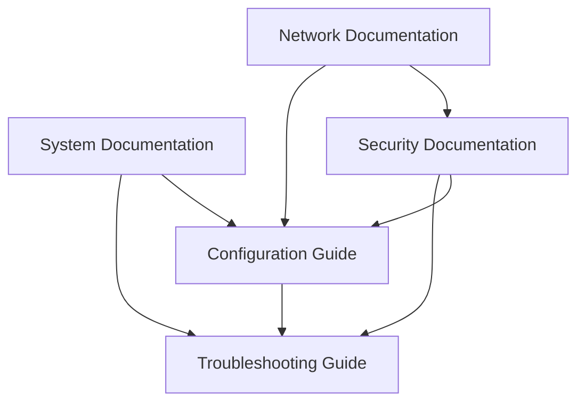

# Documentation Templates Index

---
title: Documentation Templates Index
last_updated: YYYY-MM-DD
maintainer: [Name/Team]
status: [Draft/Review/Approved]
---

## Overview

This directory contains standardized documentation templates for maintaining consistent, high-quality documentation across the project. Each template is designed to address specific documentation needs while maintaining a cohesive structure and format.

## Available Templates

### 1. [System Documentation Template](./system-documentation-template.md)
- **Purpose**: Comprehensive documentation of system components and architecture
- **Use Cases**:
  - New system implementation
  - Major system updates
  - System integration documentation
- **Key Sections**:
  - System architecture
  - Technical specifications
  - Configuration details
  - Security measures
  - Monitoring setup
- **Related Templates**:
  - Configuration Guide
  - Troubleshooting Guide

### 2. [Network Documentation Template](./network-documentation-template.md)
- **Purpose**: Detailed documentation of network infrastructure and configuration
- **Use Cases**:
  - Network setup documentation
  - Network changes and updates
  - Infrastructure planning
- **Key Sections**:
  - Network topology
  - VLAN structure
  - Security configurations
  - Performance optimization
  - Monitoring points
- **Related Templates**:
  - Security Documentation
  - Configuration Guide

### 3. [Security Documentation Template](./security-documentation-template.md)
- **Purpose**: Documentation of security measures, policies, and procedures
- **Use Cases**:
  - Security policy documentation
  - Compliance documentation
  - Security audit preparation
- **Key Sections**:
  - Security architecture
  - Access control
  - Data protection
  - Incident response
  - Compliance requirements
- **Related Templates**:
  - Network Documentation
  - Configuration Guide

### 4. [Troubleshooting Guide Template](./troubleshooting-guide-template.md)
- **Purpose**: Structured guide for diagnosing and resolving issues
- **Use Cases**:
  - System troubleshooting
  - Network diagnostics
  - Performance issues
- **Key Sections**:
  - Common issues
  - Diagnostic procedures
  - Resolution steps
  - Escalation procedures
- **Related Templates**:
  - System Documentation
  - Network Documentation

### 5. [Configuration Guide Template](./configuration-guide-template.md)
- **Purpose**: Detailed configuration management documentation
- **Use Cases**:
  - System configuration
  - Environment setup
  - Deployment configuration
- **Key Sections**:
  - Configuration structure
  - Environment variables
  - Service configuration
  - Deployment settings
- **Related Templates**:
  - System Documentation
  - Security Documentation

## Template Relationships



## Usage Guidelines

### 1. Template Selection
- Choose the appropriate template based on documentation needs
- Multiple templates may be needed for comprehensive documentation
- Follow template relationships for related documentation

### 2. Template Customization
- Maintain core structure while customizing content
- Add sections as needed for specific requirements
- Remove unnecessary sections if not applicable
- Keep consistent formatting

### 3. Documentation Standards
- Follow metadata header format
- Use proper Markdown formatting
- Include diagrams where applicable
- Maintain version control
- Update related documentation

### 4. Review Process
1. Content completeness check
2. Technical accuracy review
3. Formatting and style verification
4. Cross-reference validation
5. Final approval

## Template Maintenance

### Update Procedures
1. Regular template review
   - Quarterly assessment
   - User feedback incorporation
   - Best practices updates

2. Version Control
   - Track template changes
   - Document modifications
   - Update template relationships

### Quality Checklist
- [ ] Consistent formatting
- [ ] Clear structure
- [ ] Complete sections
- [ ] Proper cross-references
- [ ] Updated diagrams
- [ ] Valid examples
- [ ] Current best practices

## Support

### Getting Help
- Documentation team contact
- Template usage guidance
- Customization support
- Review assistance

### Contributing
- Template improvement process
- Feedback submission
- Change proposals
- Review procedures

## Change Log
```markdown
## [1.0.0] - YYYY-MM-DD
- Initial template index
```