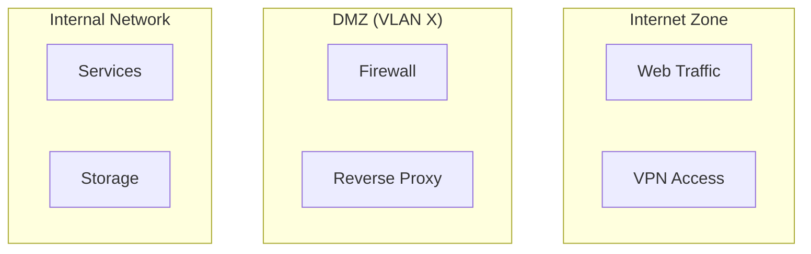

# Network Documentation

---
title: Network Documentation
last_updated: YYYY-MM-DD
maintainer: [Name/Team]
status: [Draft/Review/Approved]
---

## Network Overview

### Network Topology


### VLAN Structure
| VLAN ID | Name | Subnet | Purpose |
|---------|------|---------|---------|
| 10 | Management | 10.10.0.0/24 | Network management |
| 20 | Services | 10.20.0.0/24 | Application services |
| 30 | Storage | 10.30.0.0/24 | Data storage |

## Network Components

### Physical Infrastructure
- Switches
  - Model:
  - Firmware version:
  - Management IP:
  - Configuration backup location:

- Routers
  - Model:
  - Firmware version:
  - Management IP:
  - Configuration backup location:

### Virtual Infrastructure
- Hypervisors
  - Type:
  - Version:
  - Management interface:

- Virtual Switches
  - Configuration:
  - VLAN mappings:

## Network Security

### Firewall Rules
```yaml
inbound_rules:
  - source: [source_ip/network]
    destination: [dest_ip/network]
    port: [port_number]
    protocol: [protocol]
    action: [allow/deny]

outbound_rules:
  - source: [source_ip/network]
    destination: [dest_ip/network]
    port: [port_number]
    protocol: [protocol]
    action: [allow/deny]
```

### Access Control Lists
```yaml
acl_rules:
  - name: [ACL_NAME]
    type: [standard/extended]
    entries:
      - action: [permit/deny]
        source: [source]
        destination: [destination]
```

## Network Services

### DHCP Configuration
```yaml
dhcp_pools:
  - name: [pool_name]
    network: [network/mask]
    gateway: [gateway_ip]
    dns: [dns_servers]
    lease_time: [time]
```

### DNS Configuration
```yaml
dns_servers:
  primary: [ip_address]
  secondary: [ip_address]

dns_zones:
  - name: [zone_name]
    type: [zone_type]
    records:
      - name: [record_name]
        type: [record_type]
        value: [record_value]
```

## Routing Configuration

### Static Routes
```yaml
static_routes:
  - destination: [network/mask]
    next_hop: [gateway_ip]
    metric: [metric_value]
```

### Dynamic Routing
- Protocol: [OSPF/BGP/etc.]
- Router ID: [id]
- Areas: [area_numbers]
- Neighbors: [neighbor_ips]

## Network Monitoring

### Monitoring Points
| Component | Metric | Threshold | Alert |
|-----------|--------|-----------|-------|
| [Component] | [Metric] | [Threshold] | [Alert] |

### Health Checks
```yaml
health_checks:
  - target: [ip/hostname]
    type: [ping/http/tcp]
    interval: [seconds]
    timeout: [seconds]
    retries: [number]
```

## Backup and Recovery

### Backup Procedures
1. Network Configuration Backup
   ```bash
   backup command
   ```

2. VLAN Configuration Backup
   ```bash
   vlan backup command
   ```

### Recovery Procedures
1. Network Configuration Restore
   ```bash
   restore command
   ```

2. VLAN Configuration Restore
   ```bash
   vlan restore command
   ```

## Performance Optimization

### QoS Configuration
```yaml
qos_policies:
  - name: [policy_name]
    class: [traffic_class]
    bandwidth: [bandwidth_limit]
    priority: [priority_level]
```

### Traffic Shaping
```yaml
traffic_shaping:
  - interface: [interface_name]
    ingress_rate: [rate]
    egress_rate: [rate]
    burst: [burst_size]
```

## Troubleshooting

### Common Network Issues
1. Connectivity Issues
   - Diagnostic commands
   - Resolution steps
   - Prevention measures

2. Performance Issues
   - Diagnostic commands
   - Resolution steps
   - Prevention measures

### Network Diagnostics
```bash
# Basic connectivity test
ping [host]

# Trace route
tracert [host]

# Port connectivity
Test-NetConnection -ComputerName [host] -Port [port]

# DNS resolution
Resolve-DnsName [hostname]
```

## Documentation Standards

### Network Diagrams
1. Must include:
   - VLAN segmentation
   - IP addressing scheme
   - Security zones
   - Traffic flow
   - Physical/virtual separation

2. Format:
   - Use Mermaid for diagrams
   - Include legend
   - Show redundancy paths
   - Mark critical paths

### Configuration Documentation
1. Must document:
   - All non-default settings
   - Security rules
   - VLAN assignments
   - Routing rules
   - Access controls

2. Format:
   - Use YAML for configurations
   - Include comments
   - Version control all changes
   - Document change rationale

## Change Management

### Change Process
1. Planning
   - Impact assessment
   - Rollback plan
   - Testing procedure

2. Implementation
   - Change window
   - Verification steps
   - Documentation updates

### Change Log
```markdown
## [1.0.0] - YYYY-MM-DD
- Initial network documentation
```

## References
- Network design documents
- Vendor documentation
- Industry standards
- Security policies