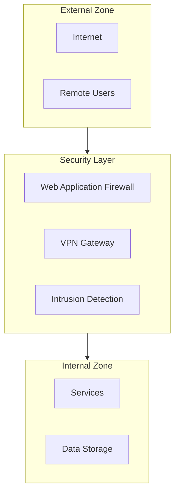

# Security Documentation

---
title: Security Documentation
last_updated: YYYY-MM-DD
maintainer: [Name/Team]
status: [Draft/Review/Approved]
classification: CONFIDENTIAL
---

## Security Overview

### Security Architecture


## Access Control

### Authentication Methods
1. OAuth2/OpenID Connect
   ```yaml
   oauth_config:
     provider: [provider_name]
     client_id: [REDACTED]
     redirect_uri: https://[domain]/callback
     scopes: [scopes]
   ```

2. Multi-Factor Authentication
   - Type: [MFA_TYPE]
   - Provider: [PROVIDER]
   - Implementation: [DETAILS]

### Authorization Matrix
| Role | Service Access | Data Access | Admin Functions |
|------|---------------|-------------|-----------------|
| Admin | Full | Full | Full |
| User | Read | Limited | None |
| Service | API | Limited | None |

## Network Security

### Security Zones
1. External Zone
   - Internet-facing services
   - DMZ configuration
   - External access controls

2. Internal Zone
   - Internal services
   - Data storage
   - Management interfaces

### Firewall Configuration
```yaml
firewall_rules:
  inbound:
    - source: [source]
      destination: [destination]
      port: [port]
      protocol: [protocol]
      action: [action]

  outbound:
    - source: [source]
      destination: [destination]
      port: [port]
      protocol: [protocol]
      action: [action]
```

## Data Protection

### Encryption Standards
1. Data at Rest
   - Algorithm: [ALGORITHM]
   - Key Length: [LENGTH]
   - Key Management: [DETAILS]

2. Data in Transit
   - Protocol: [PROTOCOL]
   - Cipher Suite: [SUITE]
   - Certificate Management: [DETAILS]

### Backup Security
1. Backup Encryption
   - Method: [METHOD]
   - Key Storage: [LOCATION]

2. Access Controls
   - Backup Access: [ROLES]
   - Restoration Process: [PROCESS]

## Security Monitoring

### Intrusion Detection
```yaml
ids_config:
  sensors:
    - location: [LOCATION]
      type: [TYPE]
      rules: [RULESET]

  alerts:
    - severity: [LEVEL]
      notification: [METHOD]
      response: [ACTION]
```

### Log Management
1. Log Collection
   ```yaml
   log_sources:
     - source: [SOURCE]
       type: [TYPE]
       retention: [PERIOD]
   ```

2. Log Analysis
   - Tools: [TOOLS]
   - Patterns: [PATTERNS]
   - Alerts: [ALERTS]

## Incident Response

### Response Procedures
1. Detection
   - Monitoring tools
   - Alert thresholds
   - Initial assessment

2. Containment
   - Immediate actions
   - System isolation
   - Evidence preservation

3. Investigation
   - Root cause analysis
   - Impact assessment
   - Timeline reconstruction

4. Recovery
   - System restoration
   - Data recovery
   - Service verification

### Contact Matrix
| Severity | Primary Contact | Secondary Contact | Escalation |
|----------|----------------|-------------------|------------|
| Critical | [CONTACT] | [CONTACT] | [CONTACT] |
| High | [CONTACT] | [CONTACT] | [CONTACT] |
| Medium | [CONTACT] | [CONTACT] | [CONTACT] |

## Compliance

### Regulatory Requirements
1. Requirement 1
   - Standard: [STANDARD]
   - Controls: [CONTROLS]
   - Validation: [METHOD]

2. Requirement 2
   - Standard: [STANDARD]
   - Controls: [CONTROLS]
   - Validation: [METHOD]

### Security Policies
1. Password Policy
   ```yaml
   password_policy:
     minimum_length: [LENGTH]
     complexity: [RULES]
     expiration: [PERIOD]
     history: [COUNT]
   ```

2. Access Policy
   ```yaml
   access_policy:
     review_period: [PERIOD]
     approval_process: [PROCESS]
     revocation: [PROCESS]
   ```

## Security Testing

### Vulnerability Scanning
```yaml
scan_schedule:
  - type: [SCAN_TYPE]
    frequency: [FREQUENCY]
    scope: [SCOPE]
    tools: [TOOLS]
```

### Penetration Testing
1. Scope
   - Systems: [SYSTEMS]
   - Networks: [NETWORKS]
   - Applications: [APPS]

2. Schedule
   - Frequency: [FREQUENCY]
   - Duration: [DURATION]
   - Reporting: [PROCESS]

## Documentation Standards

### Security Documentation Rules
1. Classification Levels
   - Public
   - Internal
   - Confidential
   - Restricted

2. Documentation Security
   - Access Controls
   - Version Control
   - Audit Trail

### Update Procedures
1. Regular Updates
   - Schedule: [SCHEDULE]
   - Review Process: [PROCESS]
   - Approval: [APPROVERS]

2. Emergency Updates
   - Triggers: [TRIGGERS]
   - Process: [PROCESS]
   - Validation: [METHOD]

## Change Log
```markdown
## [1.0.0] - YYYY-MM-DD
- Initial security documentation
```

## References
- Security standards
- Compliance frameworks
- Best practices
- Tool documentation